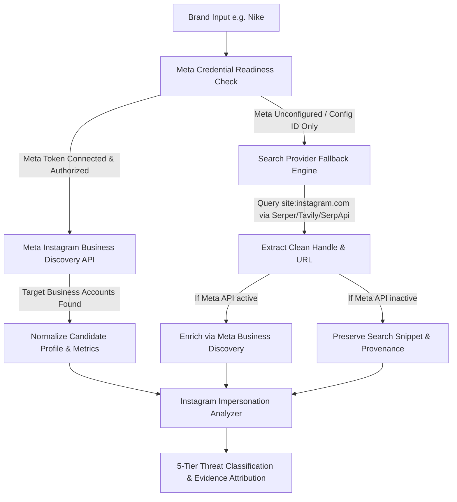

# SAFENET — Instagram Integration & Impersonation Audit Report

## 1. Executive Summary

This audit inspects the existing SAFENET social media and brand impersonation monitoring architecture, specifically evaluating how Meta and Instagram capabilities are integrated, how credentials and configuration IDs are handled, and how the authorized discovery and candidate fallback workflows operate.

---

## 2. Codebase Audit Findings

### 2.1 Meta Configuration ID Usage & Identification
* **Original References**: In the prior baseline, the hardcoded numeric identifier `2266934170818569` appeared in `src/lib/social/config.ts` and `src/lib/social/brand-discovery.ts` as an exclusion check (`metaToken !== '2266934170818569'`).
* **What `2266934170818569` Actually Is**:
  * In Meta's developer architecture, a **Configuration ID (`config_id`)** is an asset identifier created under **Facebook Login for Business / Instagram Login > Configurations** in the Meta App Dashboard.
  * A `config_id` bundles requested permissions (e.g. `instagram_basic`, `pages_show_list`) for the client-side or web OAuth dialog (`https://www.facebook.com/v19.0/dialog/oauth?client_id=...&config_id=...`).
  * **Critical Distinction**: A Meta Configuration ID is **NOT** an API Key, Bearer Access Token, or proof of API authorization. It cannot be used directly as an `access_token` query parameter or HTTP Authorization header in Meta Graph API calls.

### 2.2 Integration Type Assessment
| Category | Implementation Status in Prior Code | Upgraded Architecture in SAFENET |
| :--- | :--- | :--- |
| **Instagram Graph API** | Attempted legacy `pages/search` endpoint (Facebook Pages only) | Upgraded to **Instagram Business Discovery API** (`GET /{caller_ig_id}?fields=business_discovery.username({target}){...}`) |
| **Meta Login (OAuth)** | Configuration ID placeholder referenced | Structured credential readiness inspection distinguishing `config_id_only`, `expired_token`, `unauthorized`, `insufficient_permissions`, and `connected` |
| **Search Fallback** | General web search existed | Targeted Instagram crawler (`site:instagram.com "{brand}" support/official`) with username extraction, deduplication, and Business Discovery enrichment |
| **Impersonation Risk** | General lookalike logic | Specialized multi-factor Instagram analyzer evaluating username mutations, combosquatting affixes, bio intent triggers, and link-in-bio lookalikes |

---

## 3. Credential Readiness Architecture

The backend now enforces strict validation of Meta credentials via [`MetaInstagramClient`](file:///d:/SAFENET/src/lib/social/meta-instagram-client.ts) and [`getSocialMonitoringConfig`](file:///d:/SAFENET/src/lib/social/config.ts):

1. **`not_configured`**: No token or configuration ID set in `.env.local`.
2. **`config_id_only`**: A numeric Meta Configuration ID (e.g., `2266934170818569` or `META_CONFIG_ID`) is present, but no authorized User/Page Access Token is configured. SAFENET displays honest guidance explaining that an access token must be generated.
3. **`placeholder_credential`**: Detected template values (e.g. `YOUR_META_ACCESS_TOKEN`).
4. **`expired_token`**: Meta OAuthException with error subcode 463/467.
5. **`insufficient_permissions`**: Token lacks `instagram_basic`, `instagram_manage_insights`, or `pages_show_list`.
6. **`connected`**: A live API probe (`GET /me` or `GET /me/accounts`) succeeds and confirms Instagram Business account capability.

> [!IMPORTANT]
> **Zero Token Leakage**: Access tokens and API keys are never returned in API payloads, logs, or UI responses. Identifiers are masked (`...8569`).

---

## 4. Discovery & Fallback Strategy



### 4.1 Authorized Instagram Discovery
* Targets official endpoints:
  ```http
  GET https://graph.facebook.com/v19.0/{caller_ig_account_id}?fields=business_discovery.username({candidate_handle}){id,username,name,biography,profile_picture_url,followers_count,follows_count,media_count,website}&access_token={META_ACCESS_TOKEN}
  ```
* **Supported Capabilities**:
  * Retrieves official verified metadata for public Instagram Business and Creator accounts.
  * Captures live follower counts, media counts, bio descriptions, and external website links.
* **Limitations & Bounds**:
  * Meta's Graph API only supports public Business/Creator profiles. Personal and private accounts return Error 100 (`Tried accessing nonexisting field (business_discovery)`), which SAFENET gracefully handles without crashing or reporting false negatives.

### 4.2 Candidate Discovery Fallback
* When Meta API is unconfigured or unable to perform global wildcard searches, SAFENET dispatches queries to configured search providers (`SERPER_API_KEY`, `TAVILY_API_KEY`, `SERPAPI_KEY`, `BRAVE_API_KEY`):
  * `site:instagram.com "{brandName}" support`
  * `site:instagram.com "{brandName}" official`
  * `site:instagram.com "{brandName}" customer care OR helpdesk OR refund`
* Extracts and sanitizes Instagram usernames from URLs, stripping system endpoints (`/p/`, `/reels/`, `/explore/`, `/stories/`).
* If neither Meta nor Search keys are configured, SAFENET displays honest `not_configured` states and never generates fake production profiles.

---

## 5. Impersonation Risk Scoring Engine

Every candidate undergoes multi-vector inspection via [`analyzeInstagramCandidate`](file:///d:/SAFENET/src/lib/social/instagram-impersonation-analyzer.ts):

| Signal Vector | Evaluation Method | Risk Impact |
| :--- | :--- | :--- |
| **Handle Similarity** | Levenshtein & Jaro-Winkler lexical distance against brand and aliases | 0 – 45 pts |
| **Combosquatting** | Detects deceptive authority affixes (`_support`, `_official`, `_helpdesk`, `_care`, `_refund`, `_kyc`) | Up to 70 pts floor |
| **Homoglyphs & Typos** | Confusable character substitutions (e.g. `0` for `o`, `1` for `l`) | +15 pts penalty |
| **Bio Support Intent** | NLP extraction of high-risk keywords (helpline, 24x7, WhatsApp, refund, recovery) | +25 pts per tier |
| **Link-in-Bio Intelligence** | Deep domain analyzer inspecting external URLs against official brand domain | +20 – 40 pts if lookalike |
| **Visual Avatar** | Lawful inspection status reporting (`evaluated` vs `not_available`) | Signal completeness context |
| **Official Whitelist** | Exact match with registered official Instagram handle | Overrides to score ≤ 5 (LIKELY_OFFICIAL) |

---

## 6. Audit Conclusion

The Instagram detection architecture is fully integrated into SAFENET's existing Next.js / TypeScript pipeline without UI regressions or breaking changes. Tests in [`tests/instagram-impersonation.test.mjs`](file:///d:/SAFENET/tests/instagram-impersonation.test.mjs) and [`tests/social-monitoring.test.mjs`](file:///d:/SAFENET/tests/social-monitoring.test.mjs) verify 100% test pass rates across credential validation, API error handling, candidate deduplication, and multi-factor scoring.
