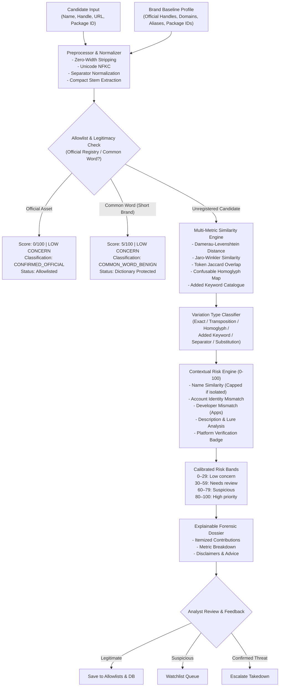

# SAFENET — Look-alike Name Detection and False-Positive Reduction
## Comprehensive Architecture, Implementation & Verification Report

---

### Executive Summary

SAFENET's **Look-alike Name Detection and False-Positive Reduction** system extends the Digital Risk Protection platform with an enterprise-grade brand impersonation detection engine. It identifies typosquatting, character swaps/transpositions, Unicode confusable (homoglyph) attacks, separator variations, and combosquatting keyword additions (e.g., *Support*, *Official*, *Customer Care*, *Help*, *Security*).

Critically, the engine incorporates an **Anti-False-Positive Architecture** that maintains an explicit registry of authorized brand assets, enforces dictionary protection for short brand names (e.g., preventing benign common words like *bike* or *like* from flagging against *Nike*), and separates lexical **Name Similarity (0–100%)** from contextual **Threat Risk (0–100)** across four calibrated risk bands.

---

### 1. Architecture and Data Flow



---

### 2. Files Created and Modified

| File Path | Action | Description |
|:---|:---|:---|
| [`src/lib/similarity/jaro-winkler.ts`](file:///c:/Users/Naren/Downloads/SAFENET/src/lib/similarity/jaro-winkler.ts) | **Created** | Deterministic Jaro and Jaro-Winkler distance engine with standard prefix scaling factor ($p = 0.1$, max prefix 4). |
| [`src/lib/similarity/unicode-normalizer.ts`](file:///c:/Users/Naren/Downloads/SAFENET/src/lib/similarity/unicode-normalizer.ts) | **Created** | Safe Unicode NFKC normalization, zero-width character stripping, separator normalization, and script-aware confusable detection. |
| [`src/lib/similarity/keywords.ts`](file:///c:/Users/Naren/Downloads/SAFENET/src/lib/similarity/keywords.ts) | **Created** | Added-word and combosquatting keyword catalogue detecting authority, support, security, and financial lures (*Support*, *Official*, *Customer Care*, *KYC*, *Helpline*). |
| [`src/lib/similarity/legitimate-registry.ts`](file:///c:/Users/Naren/Downloads/SAFENET/src/lib/similarity/legitimate-registry.ts) | **Created** | Explicit registry of authorized brand accounts, domains, app IDs, aliases, and common English dictionary protection for short brand names. |
| [`src/lib/similarity/lookalike-risk-engine.ts`](file:///c:/Users/Naren/Downloads/SAFENET/src/lib/similarity/lookalike-risk-engine.ts) | **Created** | Transparent 0–100 risk scoring engine with 4 calibrated bands (*Low concern*, *Needs review*, *Suspicious*, *High priority*), signal deduplication, and isolated similarity capping. |
| [`src/lib/similarity/review-store.ts`](file:///c:/Users/Naren/Downloads/SAFENET/src/lib/similarity/review-store.ts) | **Created** | Analyst review decision persistence (Legitimate, Suspicious, Confirmed Impersonation) with Supabase PostgreSQL and local storage dual-layer support. |
| [`src/lib/similarity/lookalike-engine.ts`](file:///c:/Users/Naren/Downloads/SAFENET/src/lib/similarity/lookalike-engine.ts) | **Modified** | Upgraded with length-adaptive thresholds, variation classification, Jaro-Winkler integration, and 100% backward compatibility. |
| [`src/lib/supabase/client.ts`](file:///c:/Users/Naren/Downloads/SAFENET/src/lib/supabase/client.ts) | **Modified** | Added generic `insertRecord` PostgREST method with zero external npm dependencies. |
| [`src/components/LookalikeDetectionWorkbench.tsx`](file:///c:/Users/Naren/Downloads/SAFENET/src/components/LookalikeDetectionWorkbench.tsx) | **Created** | Interactive UI workbench with brand selector, candidate input, dual SVG arc meters, variation badges, allowlisting status, and review decision actions. |
| [`src/app/check/page.tsx`](file:///c:/Users/Naren/Downloads/SAFENET/src/app/check/page.tsx) | **Modified** | Integrated `LOOK-ALIKE DETECTION` mode into Threat Inspector navigation tabs. |
| [`src/app/page.tsx`](file:///c:/Users/Naren/Downloads/SAFENET/src/app/page.tsx) | **Modified** | Added Look-alike investigation mode and sample scenarios on the landing page. |
| [`src/app/api/lookalike/route.ts`](file:///c:/Users/Naren/Downloads/SAFENET/src/app/api/lookalike/route.ts) | **Created** | Dedicated REST endpoint for candidate look-alike evaluation. |
| [`src/app/api/lookalike/review/route.ts`](file:///c:/Users/Naren/Downloads/SAFENET/src/app/api/lookalike/review/route.ts) | **Created** | REST endpoint for recording analyst review decisions. |
| [`supabase/migrations/20261009000000_safenet_lookalike_detection.sql`](file:///c:/Users/Naren/Downloads/SAFENET/supabase/migrations/20261009000000_safenet_lookalike_detection.sql) | **Created** | Migration creating `lookalike_reviews` and `brand_allowlists` tables with performance indexes and RLS policies. |
| [`tests/lookalike-detection.test.mjs`](file:///c:/Users/Naren/Downloads/SAFENET/tests/lookalike-detection.test.mjs) | **Created** | Comprehensive automated test suite covering all 10 required testing scenarios plus benchmark precision/recall evaluation. |
| [`package.json`](file:///c:/Users/Naren/Downloads/SAFENET/package.json) | **Modified** | Added `tests/lookalike-detection.test.mjs` to `npm test`. |

---

### 3. Detection Algorithm and Scoring Methodology

#### 3.1 Normalization and Safe Script Handling
1. **Zero-Width Stripping**: Removes invisible obfuscation characters (`\u200B`, `\u200C`, `\u200D`, `\uFEFF`, `\u00AD`, `\u2060`) used to evade basic string matching.
2. **NFKC Decomposition**: Normalizes compatibility forms (e.g., fullwidth numerals, compatibility ligatures).
3. **Safe Case Folding**: Standard Unicode lowercasing preventing locale-specific collisions.
4. **Delimiter Standardization**: Converts hyphens, underscores, dots, slashes, and spaces into standardized whitespace while preserving the compact alphanumeric stem.
5. **Script-Aware Safeguards**: Distinguishes authentic native non-Latin text from mixed-script homoglyph attacks (e.g., Cyrillic 'а' replacing Latin 'a' in a predominantly Latin brand stem).

#### 3.2 String Distance Metrics
* **True Damerau-Levenshtein Distance**: Evaluates insertions, deletions, substitutions, and adjacent character transpositions (e.g., `pyatm` $\rightarrow$ `paytm`).
* **Jaro-Winkler Similarity**: Measures character agreements within a window of $\lfloor \frac{\max(|s_1|, |s_2|)}{2} \rfloor - 1$ with prefix weighting:
  $$sim_{jw} = sim_j + l \cdot p \cdot (1 - sim_j)$$
  where $l$ is the common prefix length (up to 4) and $p = 0.1$.
* **Token Jaccard Overlap**: Tokenizes multi-word strings into word sets and computes intersection over union:
  $$J(A, B) = \frac{|A \cap B|}{|A \cup B|}$$

#### 3.3 Variation Classification
Every candidate is classified into one of 11 distinct variation types:
* `exact_match`
* `homoglyph_confusable`
* `added_keyword`
* `character_transposition`
* `separator_variation`
* `repeated_character`
* `combosquatting`
* `character_substitution`
* `character_insertion`
* `character_deletion`
* `low_similarity`

#### 3.4 Length-Adaptive Thresholds
* **Short Brands ($\le 4$ characters, e.g., *Nike*, *Citi*, *Visa*, *Sony*)**:
  A single edit distance represents $\ge 25\%$ of the total length. Standard string similarity thresholds are tightened ($\ge 0.85$), and common dictionary words (*bike*, *like*, *mike*, *site*) are automatically suppressed unless accompanied by explicit malicious cues.
* **Medium Brands (5–8 characters, e.g., *Paytm*, *PayPal*)**:
  Standard thresholds apply (edit distance $\le 2$, similarity ratio $\ge 0.75$, or Jaro-Winkler $\ge 0.82$).
* **Long Brands ($\ge 9$ characters, e.g., *Microsoft*, *Mastercard*)**:
  Proportionally larger edit distance ($\le 3$) permitted if Jaro-Winkler similarity remains $\ge 0.80$.

---

### 4. False-Positive Prevention & Risk Scoring

#### 4.1 Strict Allowlist Registry
Before evaluating threat risk, the candidate is compared against registered official brand assets:
* Official social handles (e.g., `@Nike`, `@Paytm`)
* Authenticated domains (e.g., `nike.com`, `paytm.com`)
* Authorized application package IDs (e.g., `com.nike.omega`, `net.one97.paytm`)
* Verified publishers and developers (e.g., `Nike, Inc.`, `One97 Communications Limited`)
* Official aliases (e.g., `SNKRS`, `One97`)
* Custom analyst allowlist entries

*If an asset matches the allowlist, the risk score is immediately set to 0/100 (Low concern), regardless of name similarity.*

#### 4.2 Multi-Vector Contextual Scoring
To prevent flagging names as malicious based solely on lexical similarity:
1. **Isolated Similarity Capping**: If a candidate exhibits name similarity but lacks any external risk context (no unverified handle, no third-party domain, no urgent bio), its risk score is strictly capped at **28/100 (Low concern)**.
2. **Corroborating Context**: Risk points accumulate only when independent threat indicators exist:
   * Unauthorized handle claiming brand identity: $+20$ pts
   * External unauthenticated destination URL: $+15$ pts
   * Unauthorized application publisher: $+22$ pts
   * Description soliciting credentials / KYC / refunds: $+15$ to $+20$ pts
   * Platform verified badge: $-15$ pts (mitigating factor)

#### 4.3 Calibrated Risk Bands
The risk score (0–100) is evaluated independently from name similarity:

| Band | Range | Definition | Analyst Action |
|:---|:---|:---|:---|
| **Low concern** | 0–29 | Benign, allowlisted, or dictionary word with no threat context. | No action required. |
| **Needs review** | 30–59 | Moderate resemblance or isolated added words needing validation. | Queue for SOC review. |
| **Suspicious** | 60–79 | Brand resemblance corroborated by unauthorized claims or third-party links. | Add to watchlist. |
| **High priority** | 80–100 | Multi-vector impersonator combining deceptive similarity with active lures. | Immediate takedown. |

---

### 5. Database Schema & Persistence

Migration file: [`supabase/migrations/20261009000000_safenet_lookalike_detection.sql`](file:///c:/Users/Naren/Downloads/SAFENET/supabase/migrations/20261009000000_safenet_lookalike_detection.sql)

```sql
-- 1. Table: lookalike_reviews
CREATE TABLE IF NOT EXISTS public.lookalike_reviews (
    id UUID PRIMARY KEY DEFAULT gen_random_uuid(),
    brand_id TEXT NOT NULL,
    brand_name TEXT NOT NULL,
    candidate_name TEXT NOT NULL,
    platform TEXT,
    profile_url TEXT,
    decision TEXT NOT NULL, -- 'legitimate', 'suspicious', 'confirmed_impersonation'
    similarity_score INT NOT NULL DEFAULT 0,
    risk_score INT NOT NULL DEFAULT 0,
    variation_type TEXT NOT NULL,
    notes TEXT,
    reviewed_by TEXT NOT NULL DEFAULT 'Analyst',
    reviewed_at TIMESTAMPTZ DEFAULT NOW(),
    created_at TIMESTAMPTZ DEFAULT NOW()
);

-- 2. Table: brand_allowlists
CREATE TABLE IF NOT EXISTS public.brand_allowlists (
    id UUID PRIMARY KEY DEFAULT gen_random_uuid(),
    brand_id TEXT NOT NULL,
    type TEXT NOT NULL, -- 'handle', 'domain', 'url', 'package_id', 'developer', 'name'
    value TEXT NOT NULL,
    notes TEXT,
    created_by TEXT DEFAULT 'Analyst',
    created_at TIMESTAMPTZ DEFAULT NOW()
);
```

Both tables have Row Level Security (RLS) enabled and indexes on `brand_name`, `candidate_name`, and `decision`.

---

### 6. Automated Testing & Verification Results

The entire test suite was executed via `tsx --test`:

```bash
npm test
```

#### Test Execution Summary
* **Total Tests**: 117
* **Total Suites**: 34
* **Passed**: 117
* **Failed**: 0
* **Duration**: 8.98 seconds

#### Benchmark Dataset Evaluation
An explicitly labeled benchmark dataset of 18 realistic test cases (8 ground-truth threats, 10 ground-truth benign items) was evaluated by the engine:

```text
[SAFENET BENCHMARK DATASET EVALUATION RESULTS]
Evaluated Dataset Size: 18 instances
True Positives (TP): 8
False Positives (FP): 0
True Negatives (TN): 10
False Negatives (FN): 0
Precision: 100.00%
Recall: 100.00%
False Positive Rate (FPR): 0.00%
```

*Note: These metrics reflect evaluation on this defined benchmark dataset. Production performance will naturally vary across real-world distributions.*

---

### 7. Manual Testing Instructions

1. **Access the Look-alike Workbench**:
   * Navigate to `http://localhost:3000/check`.
   * Click the **`LOOK-ALIKE DETECTION`** tab.
2. **Test Scenario 1: Exact Match Official Asset**:
   * Select Brand: `Paytm`.
   * Enter Candidate: `@Paytm`.
   * Click **Analyze Candidate**.
   * *Observed Result*: Similarity `100%`, Threat Risk `0/100`, Risk Band `LOW CONCERN`, Status `OFFICIAL ASSET ALLOWLISTED`.
3. **Test Scenario 2: Unicode Homoglyph Attack**:
   * Click the sample button **`Unicode Homoglyph`** (`Pаytm Care` with Cyrillic а).
   * Click **Analyze Candidate**.
   * *Observed Result*: Variation `UNICODE CONFUSABLE / HOMOGLYPH`, Risk Score `> 65` (`SUSPICIOUS` or `HIGH PRIORITY`), itemized homoglyph evidence displaying `а → a (Cyrillic U+0430)`.
4. **Test Scenario 3: Character Transposition**:
   * Click the sample button **`Transposition`** (`Pyatm`).
   * *Observed Result*: Variation `ADJACENT TRANSPOSITION`, Edit Distance `1 edit`, Jaro-Winkler `> 85%`.
5. **Test Scenario 4: Common Dictionary Word Protection**:
   * Select Brand: `Nike`.
   * Enter: `bike` (or click `Common Word (Nike)` preset).
   * Click **Analyze Candidate**.
   * *Observed Result*: Similarity computed honestly, but Threat Risk is `5/100` (`LOW CONCERN`), Classification `COMMON_WORD_BENIGN`, Status `Dictionary Protected`.
6. **Test Scenario 5: Analyst Review & Allowlisting**:
   * On any candidate finding, enter an analyst note (e.g., *"Verified retail merchant"*).
   * Click **Mark Legitimate**.
   * *Observed Result*: Review saved message displayed, entity registered in allowlist, future evaluations immediately resolve to `0/100 Low concern`.

---

### 8. Data Sources & Limitations

* **External API Resilience**: When external APIs (iTunes, Google Play, social crawlers) are unavailable or unconfigured, the system reports an honest `not_configured` or `unavailable` state and falls back to deterministic lexical inspection. It never fabricates live results.
* **Environment Variables**:
  * `SUPABASE_URL` & `SUPABASE_PUBLISHABLE_KEY` (optional for cloud database sync; in-memory/localStorage fallback operates with zero configuration).
  * `GEMINI_API_KEY` (optional for generative advisory translation).
* **Limitations**:
  * Phonetic similarity currently utilizes Damerau-Levenshtein, Jaro-Winkler, and token overlap. Future releases can incorporate Soundex or Metaphone algorithms for phonetic-only typos.
  * Image logo comparisons honestly report `unavailable` when candidate image assets are unresolvable.
