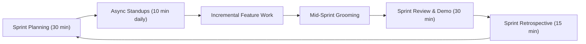

# SAFENET Agile Workflow & Team Operating Model (Phase 4)

**Document Version:** 1.0.0  
**Target:** SAFENET Development Team  
**Methodology:** Lightweight Scrum / Kanban Hybrid for Intensive Hackathon & Fast-Paced Delivery  

---

## 1. Purpose & Guiding Principles

This document formalizes the Agile Software Development Life Cycle (SDLC) tailored for the SAFENET project. In rapid student hackathon and accelerated innovation environments, heavyweight administrative overhead causes friction. SAFENET adopts a streamlined, high-visibility Agile cadence emphasizing:

1. **Working Software Over Comprehensive Bureaucracy:** Verified functionality, passing automated test suites, and clean builds take precedence over speculative designs.
2. **Deterministic Truth Over Fabricated Telemetry:** Never simulate, mock, or fake operational capabilities to meet demo deadlines.
3. **Continuous Incremental Verification:** Every code change is verified against automated unit/integration tests and build scripts before merging.
4. **Transparent Role Ownership:** Clear boundaries between architectural design, security hardening, full-stack implementation, and quality assurance.

---

## 2. Team Roles & Responsibilities

| Role | Primary Responsibilities | Artifacts Owned |
|---|---|---|
| **Agile Project Manager & Scrum Lead** | Sprint planning, backlog grooming, velocity tracking, unblocking team members, hackathon judging alignment. | `product-backlog.md`, `sprint-plan.md` |
| **Lead Software Architect** | System architecture, data flow contracts, interface boundaries, tech stack governance, performance budgets. | `architecture.md`, `data-flow.md` |
| **Cybersecurity & Threat Intelligence Engineer** | SSRF prevention, heuristic algorithms, homoglyphs, DNS/RDAP/TLS integrity, secret hygiene, takedown templates. | Security reviews, intelligence pipelines |
| **Full-Stack Implementation Engineers** | React UI components, Next.js route handlers, provider adapters, responsive UX, state stores. | App router pages, components, providers |
| **QA & Verification Engineer** | Automated test suites (`tsx --test`), edge-case matrix, error injection tests, build verification. | `test-plan.md`, `test-report.md` |

---

## 3. Agile Ceremonies (Tailored for Intensive Delivery)



### 3.1. Sprint Planning (Start of Sprint)
* **Duration:** 30 minutes.
* **Goal:** Review prioritized Product Backlog items, estimate story points (using Fibonacci: 1, 2, 3, 5, 8), define the Sprint Goal, and commit to sprint scope.

### 3.2. Asynchronous Daily Standup
* **Duration:** 10 minutes (held via team channel or quick sync).
* **Format:**
  1. What did I complete yesterday that pushed the Sprint Goal forward?
  2. What will I complete today?
  3. Are there any blockers or external API dependency issues (e.g. rate limits, token expiry)?

### 3.3. Sprint Review & Demo (End of Sprint)
* **Duration:** 30 minutes.
* **Goal:** Demonstrate working, end-to-end features on a live dev server to stakeholders and peer team members. Only items satisfying the **Definition of Done (DoD)** are demonstrated.

### 3.4. Sprint Retrospective
* **Duration:** 15 minutes.
* **Format:**
  * **What went well?** (e.g., 99 automated tests passed, clean Next 16 build).
  * **What broke or slowed us down?** (e.g., expired X/Meta API tokens, ESLint type errors).
  * **Action items for next sprint:** (e.g., add provider health status card to UI, fix linter rules).

---

## 4. Git Branching & Contribution Strategy

The team adheres to a lightweight trunk-based development model with short-lived feature branches:

```text
main (Protected, always deployable, passing builds)
  │
  ├── feat/sprint-1-brand-baseline
  ├── fix/sprint-2-provider-resilience
  ├── chore/sprint-3-eslint-cleanup
  └── docs/sprint-4-release-readiness
```

### Branching Rules
1. **Branch Naming:** `feat/<story-id>-<short-description>`, `fix/<defect-id>-<description>`, or `docs/<phase>-<description>`.
2. **Commit Messages:** Follow Conventional Commits (`feat: ...`, `fix: ...`, `docs: ...`, `test: ...`, `chore: ...`).
3. **Pull Request Quality Gates:**
   * `npm test` must pass (100% test success).
   * `npm run build` must complete with zero compilation or TypeScript errors.
   * No hardcoded API keys or secrets committed.
   * At least one peer review approval.

---

## 5. Estimation & Prioritization Matrix

Backlog items are prioritized using the **MoSCoW** framework:
* **Must Have (P0):** Critical core requirements (e.g., the 4 core features, zero fabricated data, SSRF firewall).
* **Should Have (P1):** High-value capabilities (e.g., takedown notices, multilingual advisories, Supabase PostgREST sync).
* **Could Have (P2):** Enhancements (e.g., interactive graph clustering, additional search providers).
* **Won't Have (P3 / Out of Scope):** Complex deferred items (e.g., automated registrar take-down API calls, headless browser JS crawling).
