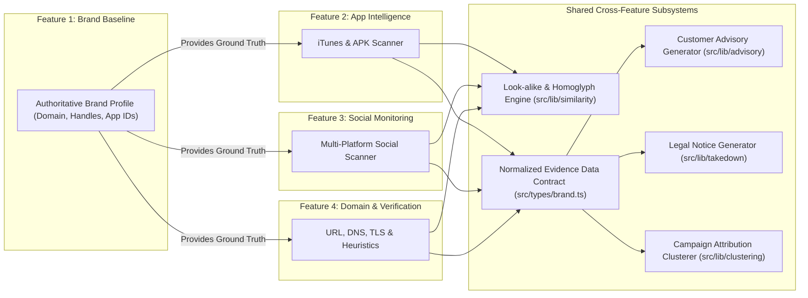

# SAFENET System Architecture & Component Design (Phase 3)

**Document Version:** 1.0.0  
**Status:** Approved Architectural Specification  
**System:** SAFENET (Digital Risk Protection & Brand Impersonation Detection Platform)  

---

## 1. Architectural Overview

SAFENET employs a modern, decoupled modular architecture powered by Next.js 16 (App Router), React 19, and a deterministic cyber threat intelligence pipeline. The design separates user interaction, API orchestration, threat heuristic evaluation, and multi-tier persistence.

### Key Architectural Pillars
1. **Deterministic Core:** Threat evaluation logic (edit distance, homoglyphs, DNS validation, RDAP parsing, TLS verification, permission auditing) is 100% deterministic, testable, and rule-based.
2. **AI-Assisted Synthesis (Optional Layer):** Google Gemini 1.5 Flash provides contextual explanation of structured technical signals without hallucinating raw telemetry.
3. **Resilient Multi-Provider Orchestration:** External network providers (Apple iTunes, YouTube, X, Meta, LinkedIn, RDAP) run under strict timeouts and isolated try/catch boundaries so that provider degradation never fails a user scan.
4. **Zero-Trust SSRF Protection:** Outbound HTTP probes are mediated by an internal security sandbox that blocks private IP ranges, cloud metadata services, and excessive redirects.
5. **Dual-Tier Data Layer:** Enterprise PostgreSQL via Supabase PostgREST client for multi-user collaboration, paired with client-side LocalStorage sandboxes for zero-setup analyst testing.

---

## 2. High-Level Architecture Diagram (Mermaid)

```mermaid
graph TD
    subgraph Presentation_Layer [Presentation Layer - Next.js 16 / React 19]
        Landing["Consumer Workspace (/)"]
        ThreatInspector["Threat Inspector (/check)"]
        AppConsole["App Threat Intelligence (/apps)"]
        SocialConsole["Social Impersonation (/social)"]
        CommandCenter["SOC Command Center (/overview)"]
        ForensicDossier["Forensic Dossier (/investigate)"]
        IncidentQueue["Incident Queue (/incidents)"]
        BrandSetup["Brand Baseline Setup (/setup)"]
        CampaignClustering["Campaign Clusters (/campaigns)"]
    end

    subgraph API_Routing_Layer [API Routing Layer - Next.js Route Handlers]
        ApiCheck["/api/check (POST)"]
        ApiApps["/api/apps/search & analyze-apk"]
        ApiSocial["/api/social/* (Discovery & Triage)"]
        ApiBrands["/api/brands & analyze (GET/POST)"]
        ApiInvestigate["/api/investigate (POST)"]
        ApiHealth["/api/health (GET)"]
    end

    subgraph Core_Intelligence_Engines [Core Intelligence & Detection Engines]
        Orchestrator["Analysis Orchestrator"]
        URLNormalizer["URL Normalizer & IDN Punycode"]
        SSRFGuard["SSRF Guard & Safe Target Validator"]
        DNSResolver["System DNS Resolver (A/AAAA)"]
        TLSInspector["TLS Handshake & SAN Inspector"]
        RDAPClient["RDAP WHOIS Age Client"]
        SimilarityEngine["Look-alike & Homoglyph Engine"]
        ScamDetector["Scam & Urgency Lure Classifier"]
        AppRiskEngine["App Candidate Risk Engine"]
        SocialRiskEngine["Social Impersonation Risk Engine"]
        GeminiInterpreter["Gemini 1.5 Flash Interpreter (Optional)"]
    end

    subgraph External_Integrations [External Networks & Providers]
        AppleStore["Apple iTunes Search API"]
        YouTubeApi["YouTube Data API v3"]
        XApi["X (Twitter) API v2"]
        MetaApi["Meta Graph API"]
        LinkedInApi["LinkedIn API"]
        PublicRDAP["RDAP.org Gateway"]
        GoogleSafeBrowsing["Threat Feeds (Safe Browsing / VT)"]
    end

    subgraph Persistence_Layer [Persistence & Data Layer]
        BrandStore["Client BrandStore (LocalStorage)"]
        VerificationStore["VerificationStore (History)"]
        SocialStore["SocialStore (Watchlist)"]
        SupabasePostgREST["Supabase Native PostgREST (PostgreSQL)"]
    end

    %% Presentation to API Routing
    Landing --> ApiCheck
    ThreatInspector --> ApiCheck
    AppConsole --> ApiApps
    SocialConsole --> ApiSocial
    CommandCenter --> ApiInvestigate
    ForensicDossier --> ApiInvestigate
    BrandSetup --> ApiBrands
    CampaignClustering --> CommandCenter

    %% API Routing to Core Engines
    ApiCheck --> Orchestrator
    ApiApps --> AppRiskEngine
    ApiSocial --> SocialRiskEngine
    ApiBrands --> SSRFGuard
    ApiInvestigate --> Orchestrator

    %% Orchestrator to Engines
    Orchestrator --> URLNormalizer
    Orchestrator --> SSRFGuard
    Orchestrator --> DNSResolver
    Orchestrator --> TLSInspector
    Orchestrator --> RDAPClient
    Orchestrator --> SimilarityEngine
    Orchestrator --> ScamDetector
    Orchestrator --> GeminiInterpreter

    %% Engines to External Providers
    AppRiskEngine --> AppleStore
    SocialRiskEngine --> YouTubeApi
    SocialRiskEngine --> XApi
    SocialRiskEngine --> MetaApi
    SocialRiskEngine --> LinkedInApi
    RDAPClient --> PublicRDAP

    %% Persistence connections
    BrandSetup -.-> BrandStore
    BrandSetup -.-> SupabasePostgREST
    SocialConsole -.-> SocialStore
    ThreatInspector -.-> VerificationStore
    IncidentQueue -.-> BrandStore
    ApiBrands -.-> SupabasePostgREST
```



---

## 3. Module Boundaries & Directory Structure

```text
src/
├── app/                      # Next.js App Router Pages and API Handlers
│   ├── api/                  # Server-side API endpoints
│   │   ├── apps/             # App store & APK analysis routes
│   │   ├── brands/           # Brand baseline & website crawler routes
│   │   ├── check/            # Unified multi-vector threat scanner
│   │   ├── health/           # System & provider diagnostic probes
│   │   ├── investigate/      # Multi-provider discovery orchestrator
│   │   ├── search/           # Web candidate search endpoints
│   │   ├── simulate/         # Attack cluster simulator
│   │   └── social/           # Multi-platform social monitoring endpoints
│   ├── apps/                 # Mobile app threat intelligence UI
│   ├── campaigns/            # Coordinated campaign clustering UI
│   ├── check/                # Threat inspector UI
│   ├── guide/                # Digital safety guide UI
│   ├── incidents/            # Incident response triage UI
│   ├── investigate/          # Forensic dossier & takedown generator UI
│   ├── overview/             # SOC Command Center UI
│   ├── reports/              # Executive briefing generator UI
│   ├── setup/                # Brand baseline registry UI
│   └── social/               # Social media monitoring console UI
├── components/               # Shared UI widgets (AppShell, Charts, Modals)
├── lib/                      # Core business logic & detection engines
│   ├── advisory/             # Multilingual safety advisory generator
│   ├── analyzers/            # Website crawler, scam parser, social analyzer
│   ├── apk/                  # Android manifest & permission evaluator
│   ├── apps/                 # Mobile app risk evaluation & types
│   ├── clustering/           # Threat campaign clustering algorithm
│   ├── intelligence/         # Multi-vector analysis orchestrator & network inspectors
│   ├── providers/            # External provider adapters (iTunes, Search, Social)
│   ├── risk-engine/          # Deterministic candidate scoring engine
│   ├── similarity/           # Damerau-Levenshtein, Jaccard, Homoglyphs
│   ├── social/               # Social discovery, fingerprinting, URL analyzer
│   ├── supabase/             # Native fetch PostgREST database client
│   ├── takedown/             # DMCA/Trademark legal notice generator
│   └── brand-store.ts        # Authoritative brand baseline manager
└── types/                    # Canonical TypeScript interfaces & data contracts
```

---

## 4. Integration of the Four Core Features

A critical architectural requirement is unifying the four core capabilities without duplicating logic or fragmenting data:



### 1. Single Source of Truth
`BrandProfile` (`src/types/brand.ts`) serves as the immutable ground-truth baseline for all detectors. When an application, social account, or domain is evaluated, it is compared against the *same* baseline allowlists (`officialDomains`, `handles`, `authorizedAppIds`, `officialDevelopers`).

### 2. Unified Similarity & Look-alike Engine
Instead of independent string-matching implementations, Feature 2 (App Spoofing), Feature 3 (Social Combosquatting), and Feature 4 (Domain Typosquatting) all invoke `src/lib/similarity/`:
* `levenshtein.ts`: Damerau-Levenshtein distance calculation.
* `homoglyphs.ts`: Confusable Unicode/Cyrillic substitution mapping.
* `lookalike-engine.ts`: Jaccard token overlap and delimiter variation.

### 3. Canonical Evidence Contract (`ThreatEvidence`)
Every finding across all 4 features maps to the normalized evidence schema:
```typescript
interface ThreatEvidence {
  id: string;
  category: 'identity' | 'domain' | 'network' | 'content' | 'app' | 'social';
  title: string;
  description: string;
  severity: 'low' | 'medium' | 'high' | 'critical';
  value: string;
  status: 'available' | 'unavailable' | 'not_applicable';
  source: string;
}
```
This guarantees that the Forensic Dossier (`/investigate`), the Campaign Clusterer (`/campaigns`), and the Executive Briefing (`/reports`) can ingest findings interchangeably.

---

## 5. Security & SSRF Defense Architecture

All outbound network requests to external URLs or web servers flow through `src/lib/intelligence/ssrf-protection.ts`:

1. **Host Extraction & IP Parsing:** Resolves the destination hostname using the system DNS resolver.
2. **Prohibited Subnet Matching:** Checks the resolved IPv4/IPv6 against forbidden CIDR ranges:
   * Loopback: `127.0.0.0/8`, `::1`, `::ffff:127.0.0.1`
   * RFC 1918 Private: `10.0.0.0/8`, `172.16.0.0/12`, `192.168.0.0/16`
   * Link-Local: `169.254.0.0/16`, `fe80::/10`
   * Cloud Metadata: `169.254.169.254`, `metadata.google.internal`
3. **Redirect Mediation:** Intercepts HTTP `3xx` redirects and recursively verifies each hop up to `SAFENET_MAX_REDIRECTS=5`.
4. **Stream Size Clamping:** Aborts socket stream if the HTTP response payload exceeds `SAFENET_MAX_RESPONSE_BYTES=524288` (512 KB).
