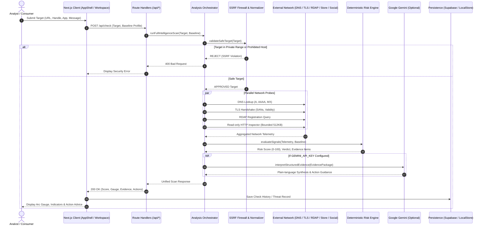
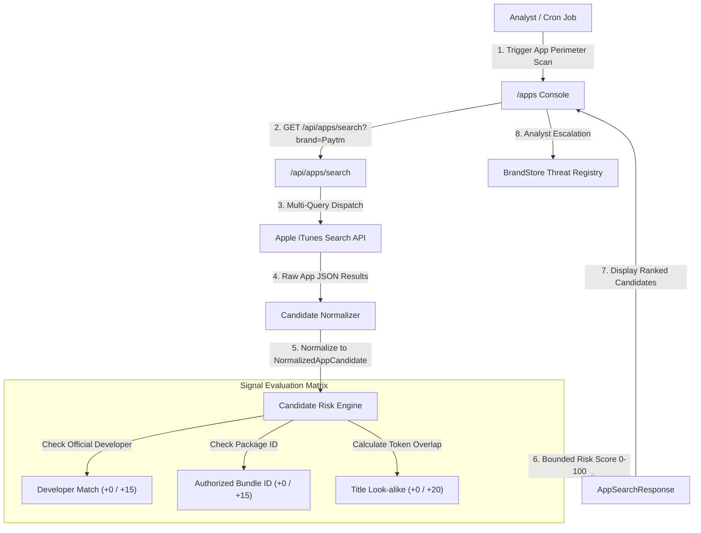

# SAFENET Data Flow & Interaction Architecture (Phase 3)

**Document Version:** 1.0.0  
**Status:** Approved Data Flow Specification  
**System:** SAFENET (Digital Risk Protection & Brand Impersonation Detection Platform)  

---

## 1. End-to-End User Flow (Mermaid)



---

## 2. Detailed Data Flows by Feature

### 2.1. Feature 1: Brand Profile Setup & Website Identity Discovery
```mermaid
graph TD
    User["Security Manager"] -->|1. Enters Domain e.g. paytm.com| SetupUI["/setup UI"]
    SetupUI -->|2. POST /api/brands/analyze| CrawlerAPI["/api/brands/analyze"]
    CrawlerAPI -->|3. Check SSRF Safety| SSRFGuard["SSRF Guard"]
    SSRFGuard -->|4. Safe Web Fetch (max 512KB)| BrandSite["https://paytm.com"]
    BrandSite -->|5. Raw HTML Response| HTMLParser["Identity Extractor"]
    HTMLParser -->|6. Extracts JSON-LD, OpenGraph, Social Links, App Badges| IdentityModel["DiscoveredBrandIdentity"]
    IdentityModel -->|7. Checklist Modal| SetupUI
    SetupUI -->|8. User Confirms Assets| SaveBaseline["Save BrandProfile"]
    SaveBaseline -->|9. Update LocalStore & Supabase| DB["Supabase / LocalStorage"]
```

1. **User Input:** Manager provides primary brand domain (`paytm.com`).
2. **SSRF Guard:** Validates destination against private CIDRs, resolves public IP.
3. **HTTP Fetch:** Issues bounded GET request (`SAFENET_MAX_RESPONSE_BYTES=524288`).
4. **Identity Parsing:**
   * Meta tags (`og:site_name`, `og:image`, `twitter:site`).
   * Schema JSON-LD (`Organization`, `Brand`).
   * Footer anchor links containing `twitter.com`, `t.me`, `instagram.com`, `linkedin.com`.
   * App store badges matching `apps.apple.com` and `play.google.com`.
5. **Human-in-the-Loop Review:** UI renders a confirmation checklist where the manager reviews discovered handles and app IDs before saving.
6. **Persistence:** Saves baseline record to both Supabase PostgreSQL (if configured) and client `BrandStore`.

---

### 2.2. Feature 2: Mobile App Store Monitoring & Threat Correlation


1. **Permutation Generation:** Generates queries: `"{Brand}"`, `"{Brand} Official"`, `"{Brand} Support"`, `"{Brand} Security"`.
2. **Live Store Query:** Calls `https://itunes.apple.com/search?term=...&entity=software&limit=25`.
3. **Normalization:** Extracts `bundleId`, `trackName`, `sellerName`, `artworkUrl512`, `trackViewUrl`, `userRatingCount`.
4. **Risk Scoring:**
   * Legitimate official developer (`One97 Communications Limited`): +0 points.
   * Unauthorized developer matching brand title: +15 points.
   * Unregistered bundle ID: +15 points.
   * High title similarity with low review count: +20 points.
5. **No Results Handling:** If no apps match, returns empty candidate list with `status: "completed"`.

---

### 2.3. Feature 3: Multi-Platform Social Media Monitoring & Triage
```mermaid
graph TD
    StartScan["Perimeter Scan Trigger"] -->|1. Run Social Scan| SocialUI["/social Console"]
    SocialUI -->|2. POST /api/social/brands/:id/scan| SocialScanAPI["/api/social/brands/:id/scan"]
    
    par Multi-Platform Ingestion
        SocialScanAPI -->|Query Live API| YouTube["YouTube Data API v3"]
        SocialScanAPI -->|Query Live API| XAPI["X API v2 (402 Handled)"]
        SocialScanAPI -->|Query Live API| MetaAPI["Meta Graph API (400 Handled)"]
        SocialScanAPI -->|Query Live API| LinkedInAPI["LinkedIn API (401 Handled)"]
        SocialScanAPI -->|Synthetic Benchmarks| DemoProvider["Demo Provider [DEMO DATA]"]
    end

    YouTube -->|Live Channels| CandidateCollector["Social Candidate Collector"]
    XAPI -->|Rate-Limited Status| CandidateCollector
    MetaAPI -->|Auth-Error Status| CandidateCollector
    LinkedInAPI -->|Auth-Error Status| CandidateCollector
    DemoProvider -->|Benchmark Profiles| CandidateCollector

    CandidateCollector -->|Deduplicate Handles| IdentityAnalyzer["Identity & Handle Analyzer"]
    
    subgraph Heuristic_Analysis [Heuristic Risk Breakdown]
        IdentityAnalyzer -->|Exact Registered Handle?| WhitelistCheck["Registered Allowlist (Risk = 0)"]
        IdentityAnalyzer -->|Combosquatting Suffix?| SuffixCheck["Support/KYC/Care (+20 pts)"]
        IdentityAnalyzer -->|Levenshtein Distance?| DistCheck["Typosquat Distance (+15 pts)"]
        IdentityAnalyzer -->|External Bio URL?| UrlCheck["Inspect Bio Link with SAFENET (+15 pts)"]
    end

    Heuristic_Analysis -->|Classify Severity| Tiers["5-Tier Classification (BENIGN to CRITICAL)"]
    Tiers -->|Structured Candidates| SocialUI
    SocialUI -->|Analyst Triage: Add to Watchlist| SocialStore["SocialStore (localStorage / Supabase)"]
```

---

### 2.4. Feature 4: Domain, URL & Phishing Threat Verification
```mermaid
graph TD
    InputURL["Suspicious URL or Domain"] -->|1. Submit| CheckUI["/check Workspace"]
    CheckUI -->|2. POST /api/check| CheckAPI["/api/check"]
    CheckAPI -->|3. Validate & Punycode Normalization| URLNormalizer["URL Normalizer"]
    
    subgraph Protocol_Inspection [Parallel Protocol Probing (2.5s Timeout)]
        URLNormalizer -->|DNS Query| DNS["System DNS Resolver (A, AAAA)"]
        URLNormalizer -->|TLS Connect| TLS["TLS Certificate Handshake"]
        URLNormalizer -->|RDAP Query| RDAP["RDAP.org Registration Age"]
        URLNormalizer -->|Bounded HTTP| HTTP["HTTP Form & Content Inspector"]
    end

    subgraph Heuristics_Engine [Heuristic Signal Analysis]
        Protocol_Inspection --> Homoglyphs["Homoglyph Unicode Detector"]
        Protocol_Inspection --> BrandMismatch["Brand Baseline Domain Comparator"]
        Protocol_Inspection --> AgePenalty["Domain Age Penalty (<30 days: +25 pts)"]
        Protocol_Inspection --> FormHarvest["Credential Form Detection (+25 pts)"]
        Protocol_Inspection --> LureDetection["Urgency Lure Detection (+15 pts)"]
    end

    Heuristics_Engine -->|Sum Bounded Points 0-100| ScoreEngine["Score & Confidence Calculator"]
    ScoreEngine -->|Structured EvidencePackage| CheckUI
    CheckUI -->|Render Forensic Arc Gauge| AnalystView["Analyst & Consumer View"]
    AnalystView -->|Generate Takedown Notice| LegalExport["DMCA / Trademark Legal Notice"]
    AnalystView -->|Generate Advisory| MultiLingual["Advisory (EN, HI, TA)"]
```

---

## 3. Error Handling, Rate Limiting & Fallback Matrix

| Subsystem | Failure Trigger | Handled Behavior | User Visibility |
|---|---|---|---|
| **System DNS** | Domain does not exist (NXDOMAIN) | Returns `resolved: false`, records `dns_unresolved` finding, does not assign critical score solely for missing DNS. | Displayed as "Domain Unresolved (No A/AAAA records)" in Network tab. |
| **RDAP Protocol** | Rate limited or unlisted TLD | Returns `registrationAge: null`, status `unavailable`. Never invents fake dates. | Displayed as "Registration Age Unknown (RDAP Unavailable)". |
| **TLS Handshake** | Self-signed or expired certificate | Flags `tls_expired` or `tls_invalid_cert` with explicit point contribution (+15). | Displayed with warning badge in Certificates view. |
| **HTTP Inspection** | Target times out (>2.5s) or blocks crawler | Aborts fetch cleanly, marks page analysis as `unavailable`, proceeds with network findings. | Page structure shown as "Inspection Inconclusive". |
| **SSRF Firewall** | Destination resolves to `127.0.0.1` or `169.254.169.254` | Socket creation aborted, returns 400 Bad Request with explicit SSRF denial reason. | Displayed as "Prohibited destination: Private or internal network addresses are blocked." |
| **X API v2** | HTTP 402 (Credits Depleted) | Provider status set to `rate_limited`. Other providers continue unimpeded. | Provider card on `/social` shows "Credits Depleted (Rate-Limited)". |
| **Meta Graph API** | HTTP 400 (Invalid Token) | Provider status set to `auth_error`. | Provider card on `/social` shows "OAuth Token Expired / Renewal Required". |
| **Google Gemini** | Missing `GEMINI_API_KEY` or quota limit | `aiStatus` set to `unavailable`; pipeline falls back to deterministic rule explanations. | Explainability card renders rule-based findings without degradation. |
| **Supabase DB** | Missing env keys or unmigrated DB | Supabase client marks `isConfigured: false`; data transparently persists in local storage. | Storage status shown as "Local Analyst Sandbox Mode". |
