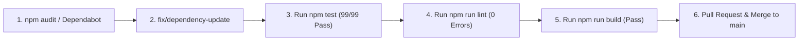
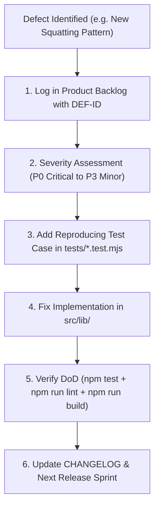

# SAFENET System Maintenance & Lifecycle Plan (Phase 7)

**Document Version:** 1.0.0  
**Status:** Approved Operations Guide  
**Project:** SAFENET (Digital Risk Protection Platform)  

---

## 1. Maintenance Strategy & Objectives

The SAFENET Maintenance Plan ensures high platform availability, rapid vulnerability remediation, continuous external threat feed alignment, and seamless integration of new features through the formalized Agile SDLC backlog.

---

## 2. Telemetry, Health Monitoring & Diagnostics

### 2.1. Central Health Check Probe (`/api/health`)
SAFENET provides a dedicated health and diagnostic endpoint (`GET /api/health`) returning structured JSON telemetry:
```json
{
  "status": "healthy",
  "timestamp": "2026-10-09T01:00:00.000Z",
  "uptimeSeconds": 1420,
  "totalLatencyMs": 48,
  "providers": {
    "dns": { "name": "System DNS Resolver", "status": "connected", "latencyMs": 12 },
    "llm": { "name": "Google Gemini 1.5 Flash", "status": "connected" },
    "database": { "name": "Supabase PostgreSQL", "status": "connected" },
    "itunes_search_api": { "status": "connected" },
    "social_media_provider": { "status": "connected" }
  }
}
```

### 2.2. Incident Thresholds & Alerting Rules
* **DNS Resolution Latency:** If DNS latency exceeds 500ms, alert platform engineering.
* **Provider Degradation:** If an external provider returns consecutive 5xx errors, the orchestrator automatically trips a circuit breaker and marks the provider `degraded` without affecting other vectors.

---

## 3. Dependency Management & Security Patching

### 3.1. Cadence & Update Cycles
* **Weekly Audit:** Run `npm audit` to identify vulnerabilities in dependencies.
* **Monthly Review:** Review minor and patch updates for core frameworks (`next`, `react`, `@google/generative-ai`, `lucide-react`).
* **Quarterly Upgrades:** Evaluate major version upgrades during dedicated technical debt sprints.

### 3.2. Patch Verification Workflow


---

## 4. Agile Bug Intake & Feature Evolution Loop

When a defect is identified or a new feature request is proposed post-release:



1. **Intake:** File item in `docs/product-backlog.md` with a unique ID, reproducible steps, and expected vs actual behavior.
2. **Prioritization:** Assign priority using MoSCoW criteria during Sprint Planning.
3. **Test-Driven Fix:** Author a failing test case in the appropriate test suite demonstrating the bug.
4. **Remediation:** Implement the minimal code change to satisfy the test while preserving existing UI and contracts.
5. **Quality Gate Verification:** Confirm that all 99+ tests pass, lint is clean, and production build succeeds.
6. **Documentation:** Record resolution in `CHANGELOG.md` and archive the closed defect.
