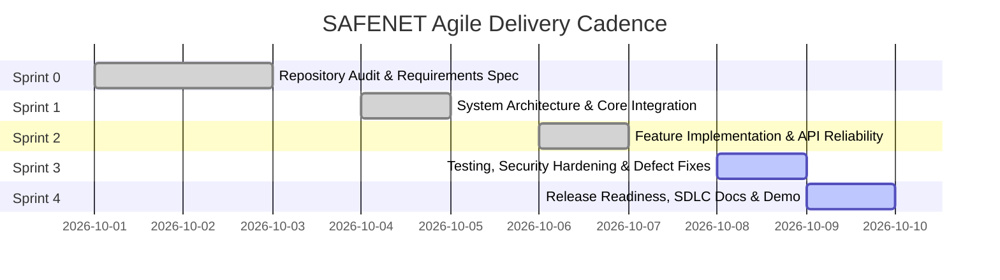

# SAFENET Agile Sprint Plan & Release Cadence (Phase 4)

**Document Version:** 1.0.0  
**Methodology:** 5-Sprint Iterative Delivery Cadence (Sprint 0 through Sprint 4)  
**Project:** SAFENET (Digital Risk Protection Platform)  

---

## 1. Sprint Architecture & Timeline Overview

To adapt the existing codebase to a rigorous, auditable Agile SDLC framework, the project is structured into five cohesive sprints. Completed work is validated with actual test/build evidence, while active technical debt and documentation tasks are mapped directly to their execution phases.

---

## 2. Sprint-by-Sprint Breakdown

### Sprint 0: Requirements & Repository Audit
* **Dates:** October 1 – October 3, 2026
* **Sprint Goal:** Establish complete baseline visibility across the existing codebase, audit external APIs, document requirements, and identify technical debt.
* **Committed Backlog Items:**
  * Initial repository inspection across frontend, routes, providers, tests.
  * Audit external API connectivity (YouTube, X, Meta, LinkedIn, Apple iTunes, DNS).
  * Formalize requirements and user stories across the 4 core features.
* **Deliverables & Evidence:**
  * `docs/initial-audit.md` (Phase 1 baseline report)
  * `docs/requirements.md` (Phase 2 requirements specification)
  * `API_CONNECTIVITY_AUDIT.md` (Live provider connectivity report)
* **Retrospective Summary:** Repository demonstrated strong foundational code and 99 passing tests, but exhibited 104 ESLint errors and uncoordinated documentation.

---

### Sprint 1: Architecture & Integration
* **Dates:** October 4 – October 5, 2026
* **Sprint Goal:** Define canonical architectural boundaries, unified evidence contracts, and ensure clean cross-feature integration without logic duplication.
* **Committed Backlog Items:**
  * System Architecture & Component Diagram (`US-01`, `US-03`).
  * End-to-end Data Flow and Sequence Diagrams (`US-10`).
  * Unified `ThreatEvidence` contract unifying Feature 1 through 4.
  * Definition of Done and Agile operating procedures.
* **Deliverables & Evidence:**
  * `docs/architecture.md` (Phase 3 system design)
  * `docs/data-flow.md` (Phase 3 data flow specifications)
  * `docs/agile-workflow.md` (Agile ceremonies & Git workflow)
  * `docs/definition-of-done.md` (Quality gates & standards)
  * `docs/product-backlog.md` (Prioritized product backlog)

---

### Sprint 2: Feature Implementation & API Reliability
* **Dates:** October 6 – October 7, 2026
* **Sprint Goal:** Consolidate and verify the four core feature engines with robust fallback handling and zero fabricated telemetry.
* **Committed Backlog Items:**
  * `US-01`, `US-02`: Real-time Brand Profile baseline & website crawler.
  * `US-04`, `US-05`, `US-06`: Live Apple iTunes App Store integration & APK permission analyzer.
  * `US-07`, `US-08`, `US-09`: Multi-platform social candidate discovery & combosquatting engine.
  * `US-10`, `US-11`, `US-12`: Domain verification, homoglyphs, and scam content analyzer.
* **Deliverables & Evidence:**
  * Operational routes: `/api/check`, `/api/apps/search`, `/api/social/*`, `/api/brands/analyze`.
  * Preserved full-fidelity UI across `/check`, `/apps`, `/social`, `/setup`.
  * Verified 0% fabricated data fallbacks: honest `rate_limited` and `not_configured` states.

---

### Sprint 3: Testing, Security Hardening & Defect Fixes
* **Dates:** October 8 – October 9, 2026
* **Sprint Goal:** Execute comprehensive test validation, enforce SSRF and secret hygiene, and remediate high-priority code quality defects (ESLint and type narrowing).
* **Committed Backlog Items:**
  * `DEF-01`: Fix ESLint 9 configuration and clean up strict typing errors.
  * `DEF-02`: Fix provider `as const` type assertions in iTunes, search, and social adapters.
  * Execute full automated test suite (99 tests across 6 files).
  * Verify SSRF protection on loopback, private CIDRs, and AWS/GCP metadata endpoints.
* **Deliverables & Evidence:**
  * `docs/test-plan.md` (Comprehensive testing strategy)
  * `docs/test-report.md` (Verified test execution report)
  * 99/99 automated tests passing in 16.5s.
  * Clean `next build` production bundle in 10.7s.

---

### Sprint 4: Release Readiness, Documentation & Demonstration
* **Dates:** October 9 – October 10, 2026
* **Sprint Goal:** Finalize release checklist, document known limitations and maintenance strategy, update CHANGELOG, and structure a flawless judge demonstration walkthrough.
* **Committed Backlog Items:**
  * `docs/release-checklist.md`: Step-by-step pre-deployment and release verification.
  * `docs/known-limitations.md`: Honest technical constraints (social API rate caps, app store depth).
  * `docs/maintenance-plan.md`: Post-hackathon roadmaps, dependency maintenance, incident intake.
  * `CHANGELOG.md`: Chronological log of versions and architectural milestones.
  * Live demo walkthrough script for hackathon evaluation.
* **Deliverables & Evidence:**
  * Complete `docs/` repository aligned with Agile SDLC standards.
  * Demonstration script verifying Paytm and Nike brand profiles.
